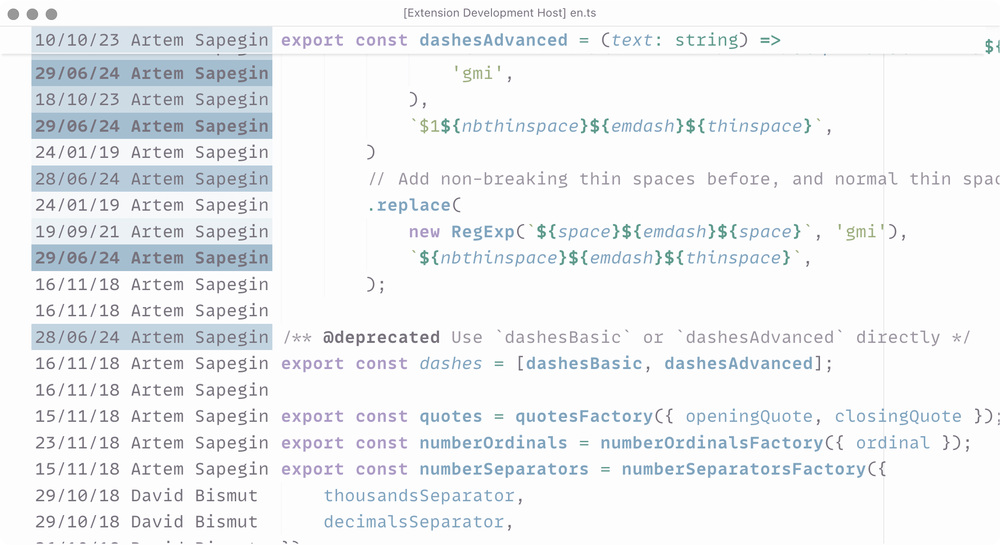
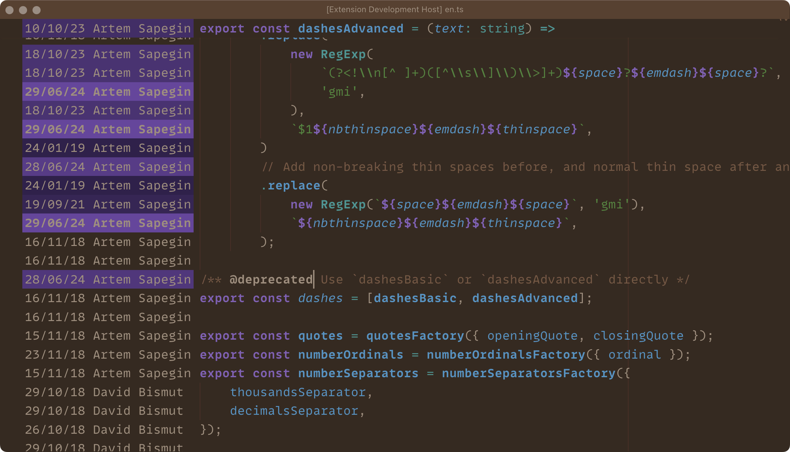
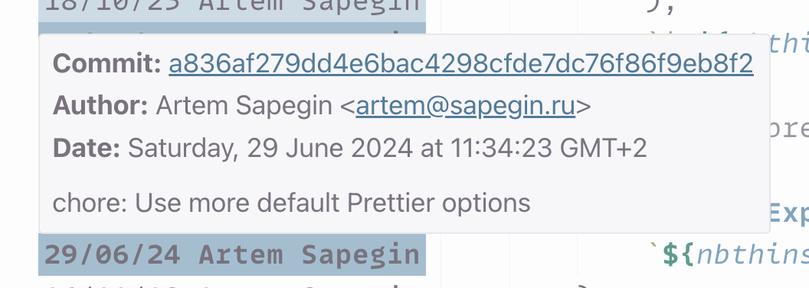

# Just Blame 🪲

Git Blame annotations, inspired by JetBrains editors.

**[Install from Visual Studio Marketplace](https://marketplace.visualstudio.com/items?itemName=sapegin.just-blame)**

With light theme:



With dark theme:



Commit information tooltip:



## Features

- Very minimal and fast.
- Heatmap like in JetBrains editors.
- Supports light and dark modes out of the box, and doesn’t come with insanely bright colors by default.
- Doesn’t pollute the editor with too many commands and hotkeys.

## Commands

You can either run this commands from the Command Palette (<kbd>Cmd</kbd>+<kbd>Shift</kbd>+<kbd>P</kbd> on a Mac, or <kbd>Ctrl</kbd>+<kbd>Shift</kbd>+<kbd>P</kbd> on Windows), or use hotkeys.

| Description | Name | Default Mac | Default Windows |
| --- | --- | --- | --- |
| Toggle Git blame annotations | `justBlame.toggleBlame` |  |  |

## Settings

You can change the following options in the [Visual Studio Code setting](https://code.visualstudio.com/docs/getstarted/settings):

| Description | Setting | Default |
| --- | --- | --- |
| Colors to show age of blame entries | `justBlame.colorScale` | See below |
| Locale to format dates | `justBlame.locale` | `en-GB` |

Here’s how a config file would look like with default options:

```json
{
  "todoTomorrow.colorScale": {
    "light": [
      "#a4bed0",
      "#aec5d5",
      "#b8ccdb",
      "#c2d4e0",
      "#cddbe5",
      "#d7e2ea",
      "#e1e9ef",
      "#ebf1f5",
      "#f5f8fa",
      "#fcfdfd"
    ],
    "dark": [
      "#8364b9",
      "#7b5ab5",
      "#734fb0",
      "#6c4aa5",
      "#65469b",
      "#5e4190",
      "#573c86",
      "#50377b",
      "#493371",
      "#422e66"
    ]
  },
  "locale": "en-GB"
}
```

## Changelog

The changelog can be found on the [Changelog.md](./Changelog.md) file.

## How is it different from other extensions?

Most Markdown extensions are bloated with commands and hotkeys I’d never need. In Just Blame I added only commands that I either use very often (like bold or italic), or can never remember the correct syntax (like tables). Other tools (like list autocomplete) make the writing comfortable.

## You may also like

Check out my other Visual Studio Code extensions:

- [Emoji Console Log](https://marketplace.visualstudio.com/items?itemName=sapegin.emoji-console-log): insert `console.log()` statements with a random emoji
- [Mini Markdown](https://marketplace.visualstudio.com/items?itemName=sapegin.mini-markdown): minimalist kit for comfortable Markdown writing
- [New File Now](https://marketplace.visualstudio.com/items?itemName=sapegin.new-file-now): create new files from the command palette
- [Notebox](https://marketplace.visualstudio.com/items?itemName=sapegin.notebox): take quick notes in the bottom panel
- [Todo Tomorrow](https://marketplace.visualstudio.com/items?itemName=sapegin.todo-tomorrow): highlight `TODO`, `HACK`, `FIXME`, etc. comments
- [Squirrelsong Light Theme](https://marketplace.visualstudio.com/items?itemName=sapegin.Theme-SquirrelsongLight): low contrast non-distracting light theme for web developers
- [Squirrelsong Dark Theme](https://marketplace.visualstudio.com/items?itemName=sapegin.Theme-SquirrelsongDark): low contrast non-distracting dark theme for web developers

## Sponsoring

This software has been developed with lots of coffee, buy me one more cup to keep it going.

<a href="https://www.buymeacoffee.com/sapegin" target="_blank"></a>

## Contributing

Bug fixes are welcome, but not new features. Please take a moment to review the [contributing guidelines](Contributing.md).

## Authors and license

[Artem Sapegin](https://sapegin.me), and [contributors](https://github.com/sapegin/vscode-just-blame/graphs/contributors).

MIT License, see the included [License.md](License.md) file.
